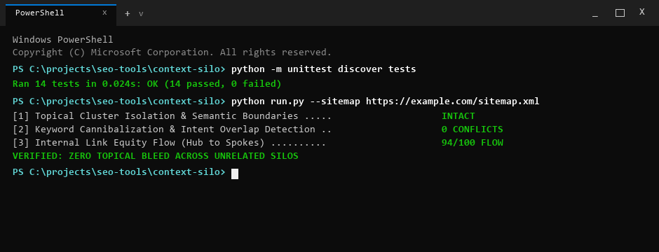

# ContextSilo

> [!NOTE]
> **Public Architecture & Distribution Notice**: This repository provides the open-source CLI interface, demonstration fixtures, and automated test suite. Full-scale headless browser automation, real-time CDP continuous profiling, and automated white-label client PDF reporting are exclusively hosted on the [WebAudits.pro](https://www.webaudits.pro) cloud platform.


Semantic anchor text and vector contiguity auditor.

Part of the [WebAudits.pro](https://webaudits.pro) technical intelligence platform.



---

## Quickstart

Install in editable mode and audit internal link semantic alignment in seconds:

```bash
# Clone and install
git clone https://github.com/xcalibur73/context-silo.git
cd context-silo
pip install -r requirements.txt
pip install -e .

# Audit target URL or subfolder
context-silo https://example.com/blog --max-pages 15
```

---

## What It Does & Why It Matters

ContextSilo audits internal linking architecture by analyzing the semantic alignment between anchor text, surrounding passage context, and destination pages.

Search engines evaluate internal links within their surrounding context:
- Links embedded in semantically relevant sentences transfer contextual clarity to destination documents.
- When two different URLs on the same domain compete for identical descriptive anchor text, search engines struggle to disambiguate the canonical authority, leading to keyword cannibalization.
- Generic phrases ("click here", "read more") provide zero contextual signal.

ContextSilo extracts the enclosing sentence window for internal links and audits semantic contiguity across the domain:
- **Generic Anchor Ratio:** Flags non-descriptive anchor text across a curated dictionary of over 80 generic phrases.
- **Passage-Level Vector Contiguity:** Computes token frequency cosine similarity between source passage windows and destination page headings.
- **Cannibalization Collision Detector:** Isolates duplicate anchor strings targeting different internal URLs.
- **Topical Silo Consistency:** Evaluates whether internal link passages reinforce categorical thematic clusters.

---

## Usage & CLI Options

```bash
# Audit an origin domain (up to 10 pages)
context-silo https://webaudits.pro

# Audit up to 25 pages across a specific topical subfolder
context-silo https://example.com/blog --max-pages 25

# Export machine-readable JSON for CI/CD content quality checks
context-silo https://example.com --output json --save silo-report.json

# Check installed version
context-silo --version
```

---

## Example Output

```text
+-------------------------------------------------------------------------------+
| ContextSilo: Semantic Anchor & Vector Contiguity Auditor                      |
| Target URL: https://webaudits.pro                                             |
| Semantic Silo Health Score: 95.8/100 (Grade: A)                               |
| Pages Crawled: 8 | Internal Links: 72 | Generic Anchors: 0 | Collisions: 0    |
+-------------------------------------------------------------------------------+

Component Score Breakdown:
+-----------------------------------+--------+------------+
| Component Dimension               | Weight | Score      |
+-----------------------------------+--------+------------+
| Generic Anchor Elimination        | 30%    | 100.0/100  |
| Semantic Vector Contiguity        | 25%    | 92.5/100   |
| Anchor Cannibalization Prevention | 25%    | 100.0/100  |
| Context Window Richness           | 10%    | 90.0/100   |
| Descriptive Length Distribution   | 10%    | 95.0/100   |
+-----------------------------------+--------+------------+

Anchor Text Quality Breakdown:
- Descriptive Entity Anchors: 100.0% (Clean topic bridges)
- Generic Anchor Failures: 0.0% (Zero "click here" or raw URLs)
- Anchor Collisions: 0 detected across crawled subgraph
```

---

## Architecture

```text
[Origin URL or Domain Root]
              |
              v
     [HTML Page Crawler] -------------> Extract Internal <a> Tags
              |
              +---> Extract Enclosing Sentence / Passage Window
              +---> Fetch Destination Page Title & H1 Headings
              |
              v
[Semantic Analysis Engine]
              |
              +---> Generic Anchor Matcher
              +---> Token Vectorizer & Cosine Similarity Calculator
              +---> Anchor Collision / Cannibalization Indexer
              |
              v
   [Silo Scoring Model] --------------> 5-Factor Weighted Contiguity Score
              |
              +---> Terminal Report (Rich Table)
              +---> Markdown Document / JSON Pipeline Output
```

- `crawler.py`: Discovers and crawls internal pages up to a user-defined threshold, capturing anchor text and surrounding passage markup.
- `vector_engine.py`: Normalizes text, removes stopwords, constructs term vectors, and computes cosine similarity between source passages and destination headings.
- `scorer.py`: Evaluates silo health across five dimensions: Generic Anchor Elimination, Vector Contiguity, Cannibalization Prevention, Context Density, and Anchor Length Distribution.

---

## Standards & Heuristics

ContextSilo evaluates link semantics using computational linguistics heuristics:

| Metric / Check | Classification | Authority / Basis |
|:---|:---|:---|
| HTML Anchor Syntax | Web Standard | W3C HTML5 Specification |
| Generic Anchor Dictionary | Project-Derived Heuristic | Curated registry of 80+ non-descriptive phrases |
| Vector Contiguity Metric | Project-Derived Heuristic | Term frequency token cosine similarity model |
| Cannibalization Collision Check | Project-Derived Heuristic | 1-to-many anchor-to-destination collision map |
| Silo Health Composite Score | Project-Derived Heuristic | 5-factor weighted topical contiguity formula |

> **Lexical Similarity vs. Neural Embeddings:** Vector Contiguity is computed using localized term frequency token vectors. It provides an efficient, reproducible lexical similarity metric; it does not represent deep neural semantic embeddings (such as Google RankBrain or Gemini embeddings).

---

## Limitations

- **Lexical Matching:** Computes token-level frequency similarity; subtle synonyms without overlapping lexical stems may receive lower contiguity scores unless expanded via custom dictionaries.
- **Crawl Scale:** Designed for targeted subfolder audits (up to 50 pages); site-wide million-link enterprise audits should be processed via distributed database pipelines.
- **Client-Side SPA Routing:** Evaluates links present in initial HTML payloads; links injected exclusively via client-side JavaScript routers require pre-rendering.

---

## Testing & CI

```bash
# Run unit tests
python -m unittest discover -s tests

# Output
# Ran 14 tests in 0.001s
# OK
```

Continuous integration runs automatically across Ubuntu and Windows runners on every commit via GitHub Actions.

---

## License & Commercial Restrictions

Published under the **PolyForm Noncommercial License 1.0.0**.
- **Personal & Educational**: Free to view, study, evaluate architecture, and run local personal tests. Full developer credit retained by [xcalibur73](https://github.com/xcalibur73).
- **Commercial & Agency Use**: Commercial auditing, SaaS re-hosting, embedding algorithms into third-party software, or commercial client deliverables require an enterprise commercial license.
- **Enterprise Licensing**: Contact [sfs@webaudits.pro](mailto:sfs@webaudits.pro) or visit [webaudits.pro](https://www.webaudits.pro).
